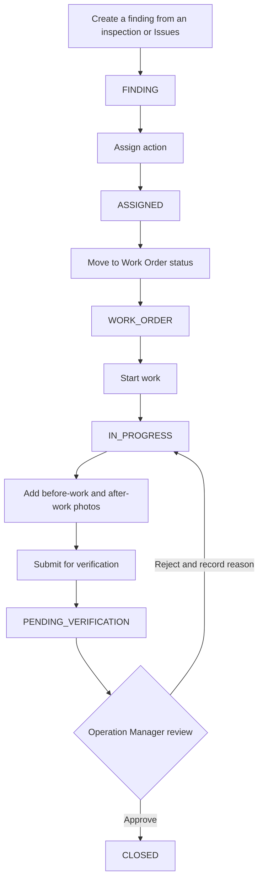
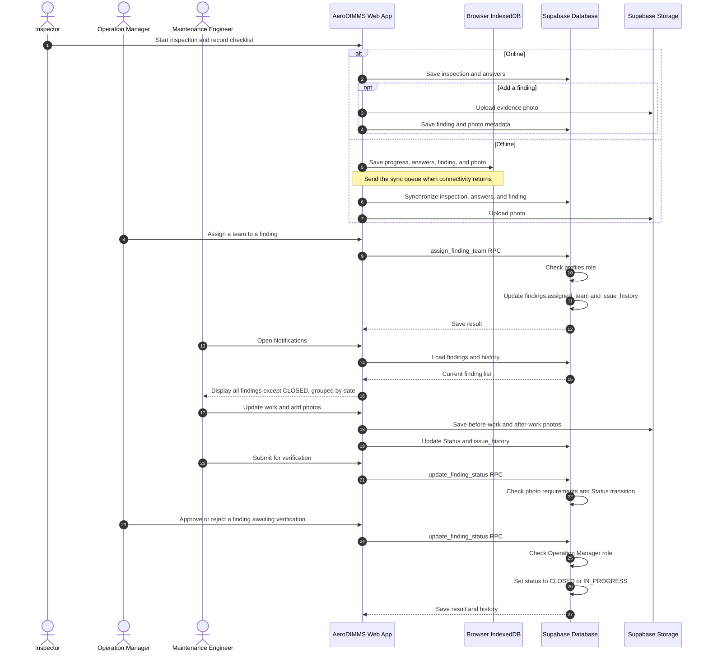
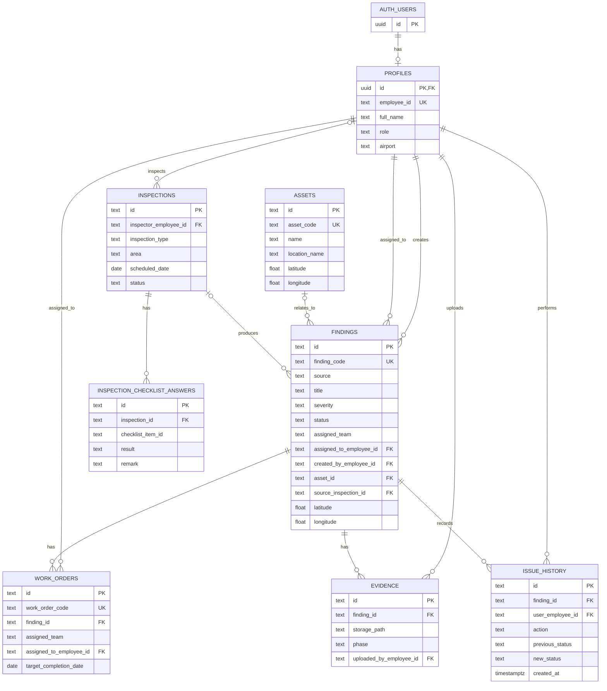

# AeroDIMMS Fukuoka

[日本語](README.md) | [English](README.en.md)

AeroDIMMS is a web application for airport facility inspections and maintenance issue management. It brings inspection results and findings (defects and follow-up tasks) together in maps and lists, helping Inspectors, Maintenance Engineers, and Operation Managers coordinate work from inspection through repair and final approval.

## Contents

- [Features](#features)
- [Users and roles](#users-and-roles)
- [Finding workflow](#finding-workflow)
- [Sequence diagram](#sequence-diagram)
- [ER diagram](#er-diagram)
- [Technology stack](#technology-stack)
- [Getting started](#getting-started)
- [Supabase setup](#supabase-setup)
- [How to use the app](#how-to-use-the-app)
- [Offline use and limitations](#offline-use-and-limitations)
- [Project structure](#project-structure)

## Features

- **Dashboard** — Shows Open, Critical, Overdue, and Pending Verification counts, priority findings, and recent activity.
- **Inspections** — Browse scheduled inspections, start an inspection, record Pass / Fail / N/A checklist results and remarks, and save the completed inspection. Inspectors can add findings and evidence photos during an inspection. Operation Managers can create inspections.
- **Issues** — Browse findings and filter by Status, Severity, Source, Location, and Assignee. The detail view shows work order information, assigned team, due date, location, evidence photos, and history.
- **Maintenance workflow** — Manage finding registration and status transitions, view registered Work Order information, and review completion. Before a finding can be submitted for verification, it must have both a before-work and an after-work photo.
- **Operation Manager workspace** — Assign a team to each finding, open the verification queue, and delete findings that are no longer needed. Deletion requires confirmation.
- **Final review** — Operation Managers can approve a finding awaiting verification and close it, or reject it, record a reason, and return it for more work.
- **Maintenance Notifications** — Maintenance Engineers can view every finding that is not CLOSED. Notifications show the finding title, assigned team, current Status, and last-updated date, grouped into Today / Yesterday / Earlier. Findings without a team show Unassigned.
- **Map** — Displays Fukuoka Airport stands, open findings, and assets. It supports search, current-location display, layer toggles, and marker details. Stand locations are loaded from `public/fukuoka-airport.geojson`.
- **Offline work** — Supported inspection progress, checklist answers, locally recorded findings, and photos are stored in IndexedDB and synchronized when the connection returns. Connection and synchronization status are shown in the app header.

## Users and roles

| Role | Main capabilities |
| --- | --- |
| `INSPECTOR` | Browse and perform inspections, record checklist results, create findings |
| `MAINTENANCE_ENGINEER` | Browse issue lists and details, update maintenance information, use Maintenance Notifications |
| `OPERATIONS_MANAGER` | Create inspections, assign finding teams, delete findings, approve or reject findings awaiting verification |

Signing in requires a Supabase Auth user and a matching row in `public.profiles` with the same Auth ID. The app controls navigation by role, and Supabase RPC functions also verify the Operation Manager role for team assignment, deletion, and final approval or rejection.

## Finding workflow



Team assignment is independent of this Status workflow. An Operation Manager can assign a team to a finding at any point. Status and team changes are recorded in `issue_history`. Deleting a finding also deletes its related Work Orders, evidence metadata, and history.

## Sequence diagram

If the network connection drops during an inspection, supported data is saved in the browser and synchronized after the connection returns. Team assignments are saved through an RPC that checks the user's role. Notifications are built from current finding data when the page loads; they are not push notifications.



## ER diagram

Teams are not stored in a separate table. The current schema stores them as text in `findings.assigned_team` and `work_orders.assigned_team`. Photo files are stored in the private `finding-evidence` Supabase Storage bucket; the `evidence` table stores each file's path and metadata.



## Technology stack

| Area | Technology |
| --- | --- |
| Web framework | Next.js 16 App Router |
| UI | React 19, TypeScript 5, Tailwind CSS 4 |
| Authentication / database | Supabase Auth, PostgreSQL, Row Level Security, RPC |
| Photos | Supabase Storage (private bucket) |
| Map | MapLibre GL JS, Fukuoka Airport GeoJSON, Esri World Imagery tiles |
| Offline storage | IndexedDB (inspection queue and photos), localStorage (demo data and cached login profile) |
| Development / linting | npm, ESLint |

## Getting started

### Requirements

- Node.js and npm
- A Supabase project for cloud mode and Supabase Auth sign-in

### Run locally

```bash
npm ci
```

Create `.env.local` using `.env.example` as a template:

```env
NEXT_PUBLIC_SUPABASE_URL=https://your-project.supabase.co
NEXT_PUBLIC_SUPABASE_ANON_KEY=your-anon-key
NEXT_PUBLIC_DEMO_MODE=false
```

After setting up Supabase and its tables, start the development server:

```bash
npm run dev
```

Open [http://localhost:3000](http://localhost:3000) in a browser. After signing in, the app opens the Dashboard.

### Common commands

```bash
npm run dev       # Start the development server
npm run lint      # Run ESLint
npm run build     # Create a production build
npm run start     # Start the production build
```

### Demo data mode

Set `NEXT_PUBLIC_DEMO_MODE=true` to read and write operational data from browser demo state instead of Supabase. Demo data is stored in localStorage for that browser. The login page still uses Supabase Auth, so the usual sign-in flow requires an Auth user and a Profile. See [`supabase/demo-data/README.md`](supabase/demo-data/README.md) for importing demo CSV files into Supabase.

## Supabase setup

Run these scripts in order in the Supabase Dashboard SQL Editor:

1. [`supabase/profiles.sql`](supabase/profiles.sql) — Creates the Profile table and its base RLS policy.
2. [`supabase/schema.sql`](supabase/schema.sql) — Creates Assets, Findings, Work Orders, Evidence, History, and status, team-assignment, and delete RPC functions.
3. [`supabase/inspection-schema.sql`](supabase/inspection-schema.sql) — Adds inspections, checklist answers, inspection fields on findings, and the evidence Storage bucket and policies.

Then create the sign-in users in Supabase Auth and add a matching `profiles` row for each Auth user ID. The `role` must be one of `INSPECTOR`, `MAINTENANCE_ENGINEER`, or `OPERATIONS_MANAGER`. Public sign-up is not enabled.

Demo CSV import order, row counts, and other details are in [`supabase/demo-data/README.md`](supabase/demo-data/README.md). IDs in the sample `profiles.csv` are placeholders; do not import them as real Profiles without creating matching Auth users.

## How to use the app

1. Sign in with the email address and password for a Supabase Auth account.
2. Use the **Dashboard** to review priority items, overdue work, and findings awaiting verification.
3. Inspectors can open an inspection under **Inspections**, record checklist results and remarks, and add findings, GPS, and evidence photos when needed.
4. Search and filter findings in **Issues**, then open an issue from its ID.
5. Operation Managers can assign a team to each finding from **Team Assignment**. To delete a finding, choose Delete and confirm in the dialog.
6. Maintenance Engineers can review all active findings in **Notifications**, grouped by last update, and open a finding to update work details and evidence photos.
7. After work is complete, submit the finding for verification. An Operation Manager reviews it under **Pending Verification** and approves or rejects it.
8. On the **Map**, select a stand or finding marker to view field details. Map tiles require network access; browser location also requires location permission.

## Offline use and limitations

- When disconnected, supported inspection data is temporarily saved in IndexedDB and the app shows its offline state. The sync queue is processed when connectivity returns.
- Data that fails to synchronize remains stored locally and is retried after reconnection. Check the Sync status in the app header for pending work or errors.
- Server-side actions such as team assignment, deleting a Supabase finding, and Storage photo operations require a network connection.
- Notifications are not push messages and do not have read/unread state. The page loads current findings when opened and groups them by the local date of `updated_at`.
- Map location and photo GPS depend on browser permissions and device support. Findings can be recorded without GPS, but findings without coordinates do not appear as map markers.
- The map background comes from Esri's external tile service and may not be available offline.

## Project structure

```text
app/                           App Router pages
components/                    Dashboard, Issues, Inspections, Map, and other UI
lib/                           Data models, offline storage/sync, Supabase operations
lib/supabase/                  Supabase client and write operations
public/fukuoka-airport.geojson  Airport stand locations
supabase/schema.sql            Operational tables, RLS, and RPC functions
supabase/inspection-schema.sql Inspection tables, photo Storage, and RLS
supabase/demo-data/             Seed CSV files and import instructions
```
