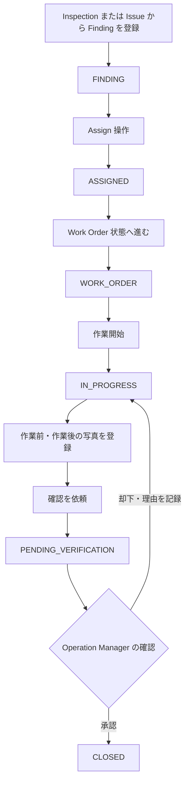
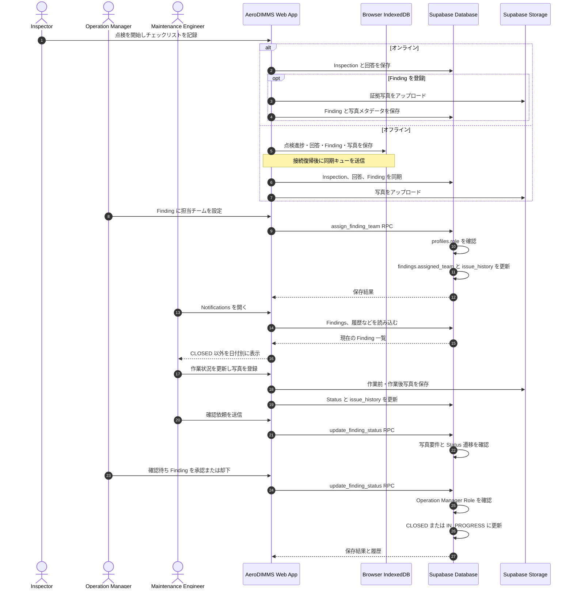
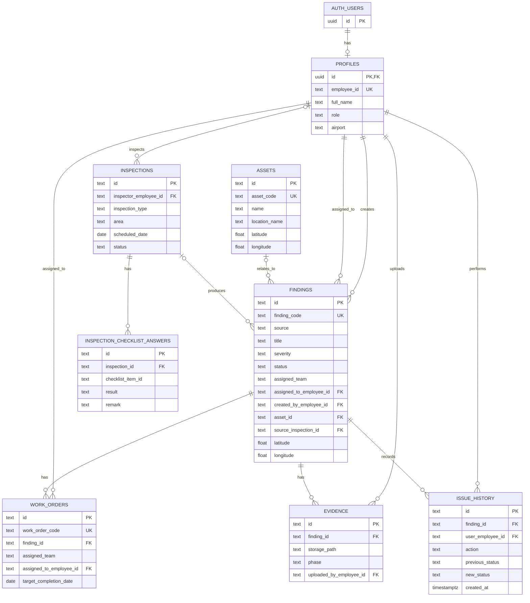

# AeroDIMMS Fukuoka

[日本語](README.md) | [English](README.en.md)

AeroDIMMS は、空港の施設点検から不具合の記録、修繕依頼、作業状況の確認、完了承認までを扱う業務用 Web アプリです。点検結果と Finding（不具合・対応タスク）を地図と一覧で共有し、Inspector、Maintenance Engineer、Operation Manager の間で対応状況を管理します。

## 目次

- [主な機能](#主な機能)
- [ユーザーと権限](#ユーザーと権限)
- [Finding の対応フロー](#finding-の対応フロー)
- [シーケンス図](#シーケンス図)
- [ER 図](#er-図)
- [技術スタック](#技術スタック)
- [起動方法](#起動方法)
- [Supabase のセットアップ](#supabase-のセットアップ)
- [使い方](#使い方)
- [オフライン利用と制約](#オフライン利用と制約)
- [主なディレクトリ](#主なディレクトリ)

## 主な機能

- **Dashboard** — Open、Critical、Overdue、Pending Verification の件数、優先対応 Finding、最近の操作履歴を表示します。
- **Inspections** — 点検予定の確認、点検の開始、チェックリストへの Pass / Fail / N/A とメモの記録、点検結果の完了保存を行います。Inspector は点検中に Finding と証拠写真を登録できます。Operation Manager は点検を作成できます。
- **Issues** — Finding を一覧し、Status、Severity、Source、Location、Assignee で絞り込めます。詳細画面では作業指示、担当チーム、期限、位置情報、写真、履歴を確認できます。
- **修繕ワークフロー** — Finding の登録、Status 遷移、登録済み Work Order 情報、完了確認までを管理します。作業中から確認依頼へ進むには、作業前・作業後の写真が必要です。
- **Operation Manager の管理画面** — Finding ごとの担当チーム設定、確認待ち一覧への移動、不要な Finding の削除を行います。削除には確認操作が必要です。
- **最終確認** — Operation Manager は確認待ち Finding を承認して完了にするか、理由を記録して追加作業へ戻せます。
- **Maintenance Notifications** — Maintenance Engineer は CLOSED 以外の Finding を確認できます。Finding のタイトル、担当チーム、現在の Status、最終更新日時を Today / Yesterday / Earlier に分けて表示します。担当チームが未設定の場合は Unassigned と表示します。
- **Map** — 福岡空港の駐機スポット、Open Finding、Asset を地図上に表示します。検索、現在地表示、レイヤーの表示切替、マーカーからの詳細確認に対応します。駐機スポットの形状・座標は `public/fukuoka-airport.geojson` を使用します。
- **オフライン作業** — 対応している点検進捗、チェックリスト回答、ローカル Finding と写真を IndexedDB に保持し、オンライン復帰後に同期します。接続状態と同期状態は画面上部に表示します。

## ユーザーと権限

| Role | 主な利用機能 |
| --- | --- |
| `INSPECTOR` | 点検一覧・実施、チェックリスト記録、Finding の登録 |
| `MAINTENANCE_ENGINEER` | Issue 一覧・詳細、修繕情報の更新、Maintenance Notifications |
| `OPERATIONS_MANAGER` | 点検作成、担当チーム割当、Finding 削除、確認待ち Finding の承認・却下 |

ログインには Supabase Auth ユーザーと、同じ Auth ID を持つ `public.profiles` レコードが必要です。画面のナビゲーション制御に加え、担当割当・削除・最終承認は Supabase RPC 側でも Operation Manager の Role を確認します。

## Finding の対応フロー



担当チームの設定はこの Status 遷移とは独立しており、Operation Manager がいつでも Finding に設定できます。Status の変更履歴、担当チーム変更履歴は `issue_history` に記録されます。Finding 削除では関連する Work Order、写真メタデータ、履歴も削除されます。

## シーケンス図

点検中にネットワークが切れた場合はブラウザー内に一時保存し、復帰後に同期します。Operation Manager によるチーム割当は RPC で Role を確認して保存します。Notifications はプッシュ配信ではなく、画面表示時に現在の Finding データから組み立てる一覧です。



## ER 図

チームは別テーブルではなく、現状 `findings.assigned_team` と `work_orders.assigned_team` の文字列として保持します。Supabase Storage の写真本体は `finding-evidence` バケットに保存し、`evidence` テーブルにはそのパスとメタデータを保存します。



## 技術スタック

| 分野 | 技術 |
| --- | --- |
| Web framework | Next.js 16 App Router |
| UI | React 19、TypeScript 5、Tailwind CSS 4 |
| Authentication / Database | Supabase Auth、PostgreSQL、Row Level Security、RPC |
| 写真 | Supabase Storage（private bucket） |
| 地図 | MapLibre GL JS、福岡空港 GeoJSON、Esri World Imagery タイル |
| オフライン保存 | IndexedDB（点検キュー・写真）、localStorage（デモデータ・ログイン Profile キャッシュ） |
| 開発・静的解析 | npm、ESLint |

## 起動方法

### 必要なもの

- Node.js と npm
- Supabase プロジェクト（クラウドモード、Auth によるログインを使う場合）

### ローカル起動

```bash
npm ci
```

`.env.example` を参考に `.env.local` を作成します。

```env
NEXT_PUBLIC_SUPABASE_URL=https://your-project.supabase.co
NEXT_PUBLIC_SUPABASE_ANON_KEY=your-anon-key
NEXT_PUBLIC_DEMO_MODE=false
```

Supabase の設定とテーブルを準備してから開発サーバーを起動します。

```bash
npm run dev
```

ブラウザーで [http://localhost:3000](http://localhost:3000) を開きます。ログイン後、Dashboard に移動します。

### 主なコマンド

```bash
npm run dev       # 開発サーバー
npm run lint      # ESLint
npm run build     # 本番ビルド
npm run start     # ビルド済みアプリの起動
```

### デモデータモード

`NEXT_PUBLIC_DEMO_MODE=true` にすると、業務データを Supabase ではなくブラウザーのデモ状態から読み書きします。デモデータはそのブラウザーの localStorage に保存されます。ログイン画面自体は Supabase Auth を使うため、通常のログイン経路を使う場合は Auth ユーザーと Profile も必要です。CSV の Supabase 取込手順は [`supabase/demo-data/README.md`](supabase/demo-data/README.md) を参照してください。

## Supabase のセットアップ

Supabase Dashboard の SQL Editor で次の順に実行します。

1. [`supabase/profiles.sql`](supabase/profiles.sql) — Profile テーブルと基本 RLS。
2. [`supabase/schema.sql`](supabase/schema.sql) — Assets、Findings、Work Orders、Evidence、History、Status / チーム割当 / 削除 RPC。
3. [`supabase/inspection-schema.sql`](supabase/inspection-schema.sql) — Inspection、チェックリスト回答、Finding の点検関連フィールド、Storage bucket とポリシー。

続いて Supabase Auth にログイン用ユーザーを作成し、各 Auth User ID に対応する `profiles` レコードを用意します。`role` は `INSPECTOR`、`MAINTENANCE_ENGINEER`、`OPERATIONS_MANAGER` のいずれかです。公開サインアップ機能はありません。

デモ CSV の投入や必要な取込順序・件数は [`supabase/demo-data/README.md`](supabase/demo-data/README.md) に記載しています。サンプル `profiles.csv` の Auth ID はダミー値なので、実ユーザーを作らずにそのまま Profile テーブルへ投入しないでください。

## 使い方

1. ログイン画面から Supabase Auth のメールアドレスとパスワードでログインします。
2. **Dashboard** で優先対応、期限超過、確認待ちの件数を確認します。
3. Inspector は **Inspections** から点検を開き、チェック項目の結果とメモを保存します。必要に応じて Finding、GPS、証拠写真を登録します。
4. **Issues** で Finding を検索・絞り込み、Issue ID から詳細を開きます。
5. Operation Manager は **Team Assignment** で Finding ごとに担当チームを入力して保存します。削除する場合は Delete を選び、確認ダイアログで確定します。
6. Maintenance Engineer は **Notifications** ですべての未完了 Finding を更新日順に確認し、Finding 詳細から作業情報や証拠写真を更新します。
7. 作業完了後に確認を依頼します。Operation Manager が **Pending Verification** の Finding を確認し、承認または却下します。
8. **Map** ではスポットまたは Finding マーカーを選択して現場情報を確認します。地図画像タイルとブラウザーの位置情報にはネットワーク・位置情報の許可が必要です。

## オフライン利用と制約

- 接続がない場合、対応する点検作業データは IndexedDB に一時保存され、画面にはオフライン状態が表示されます。同期可能な状態になるとキューを自動処理します。
- 同期が失敗したデータはローカルに保持され、接続復帰後に再試行します。画面の Sync 状態から保留・エラーを確認できます。
- 担当チーム割当、Supabase 上の Finding 削除、写真 Storage 操作など、サーバー更新を伴う操作にはネットワークが必要です。
- Notifications はプッシュ通知や既読管理ではありません。画面を開いた時点の Finding を読み込み、`updated_at` のローカル日付で分類します。
- 地図の現在地や写真の GPS は、ブラウザーの権限と対応する端末機能に依存します。GPS がない Finding も Issue 管理に登録できますが、地図上の位置マーカーは表示されません。
- 地図の背景画像は Esri の外部タイルサービスから取得します。オフラインでは背景地図が表示できない場合があります。

## 主なディレクトリ

```text
app/                         App Router ページ
components/                  Dashboard、Issue、Inspection、Map などの画面
lib/                         データモデル、オフライン保存・同期、Supabase 処理
lib/supabase/                Supabase client と書き込み処理
public/fukuoka-airport.geojson  駐機スポットの位置データ
supabase/schema.sql          業務テーブル、RLS、RPC
supabase/inspection-schema.sql 点検テーブル、写真 Storage、RLS
supabase/demo-data/          初期投入用 CSV と取込手順
```
